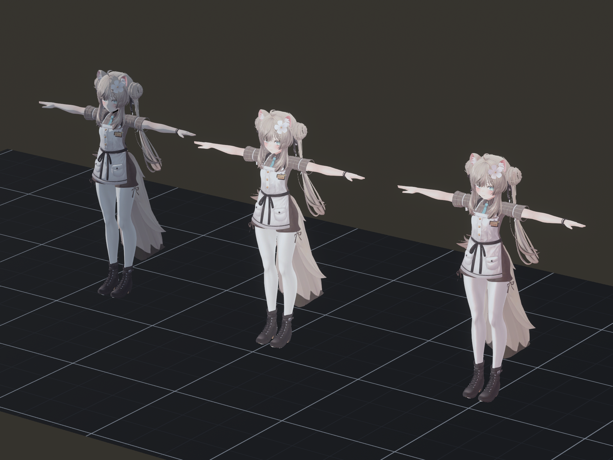
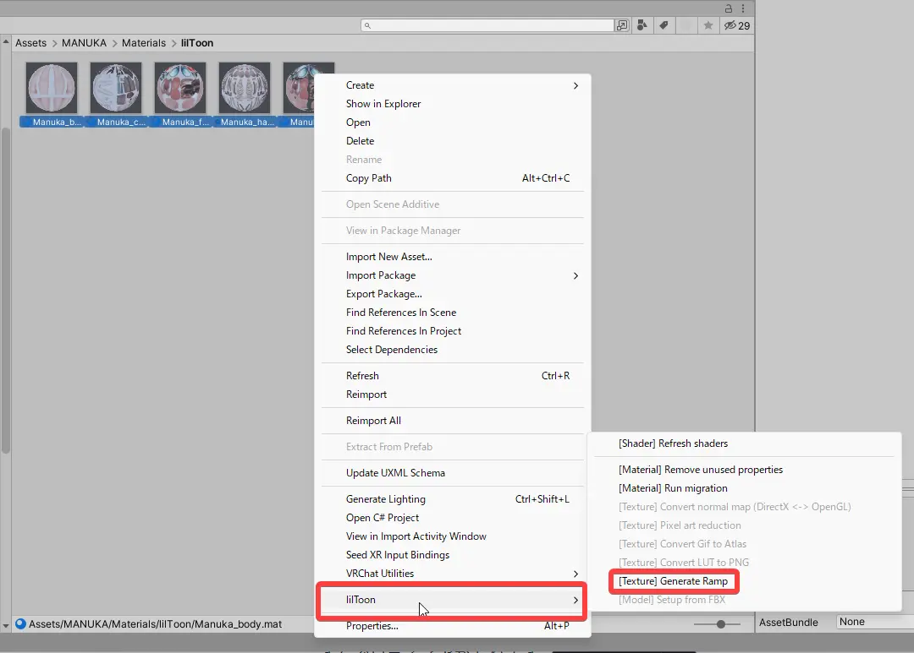
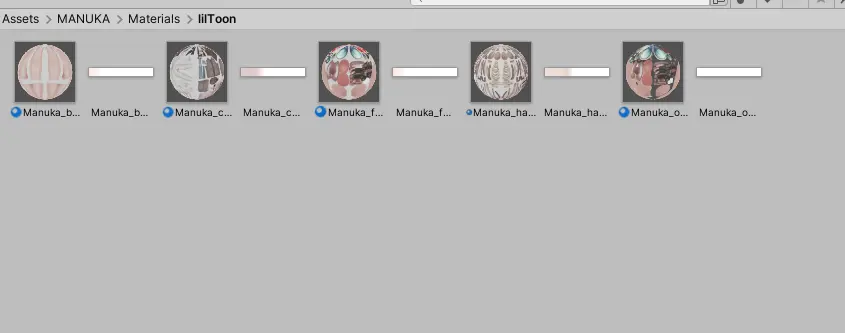
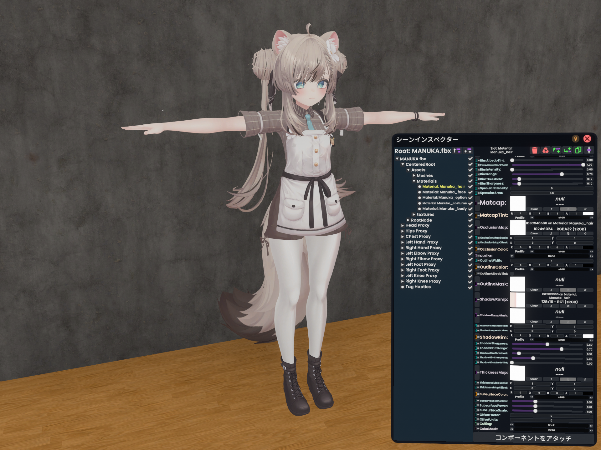
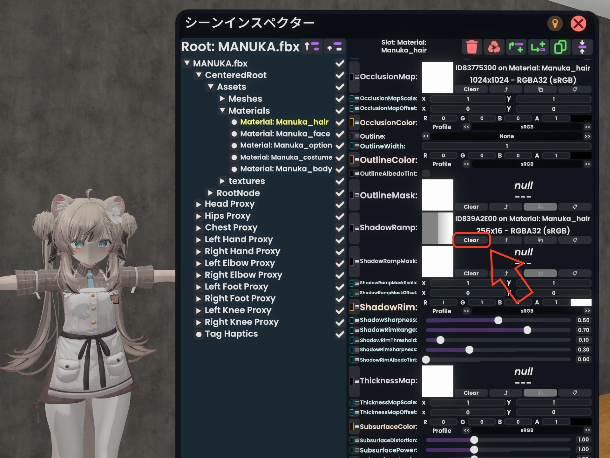
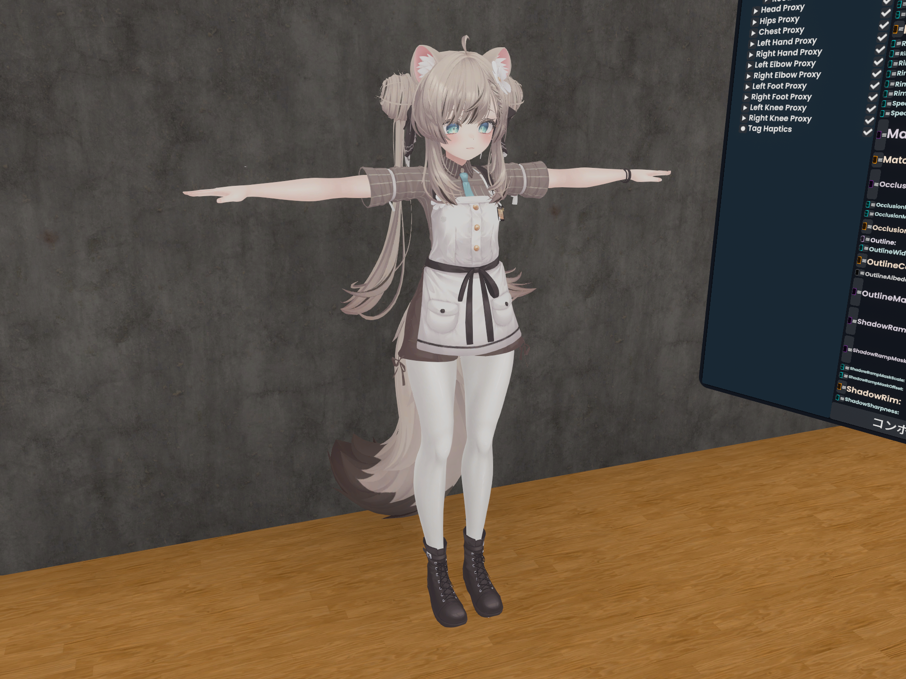
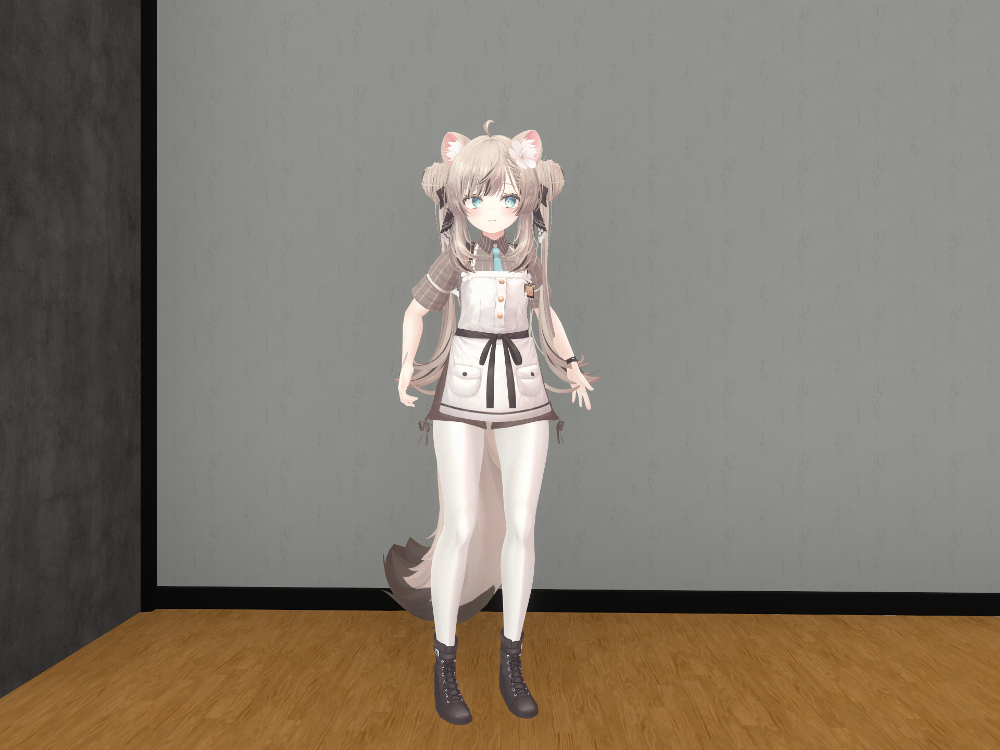
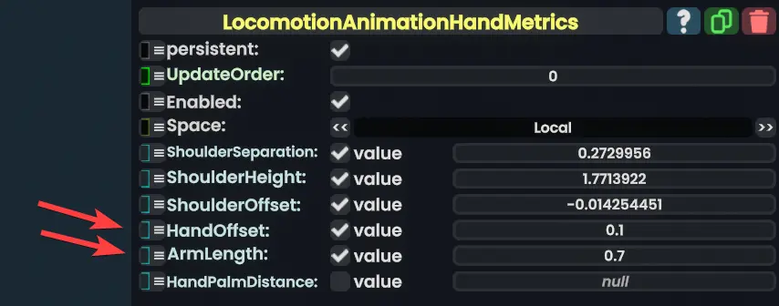
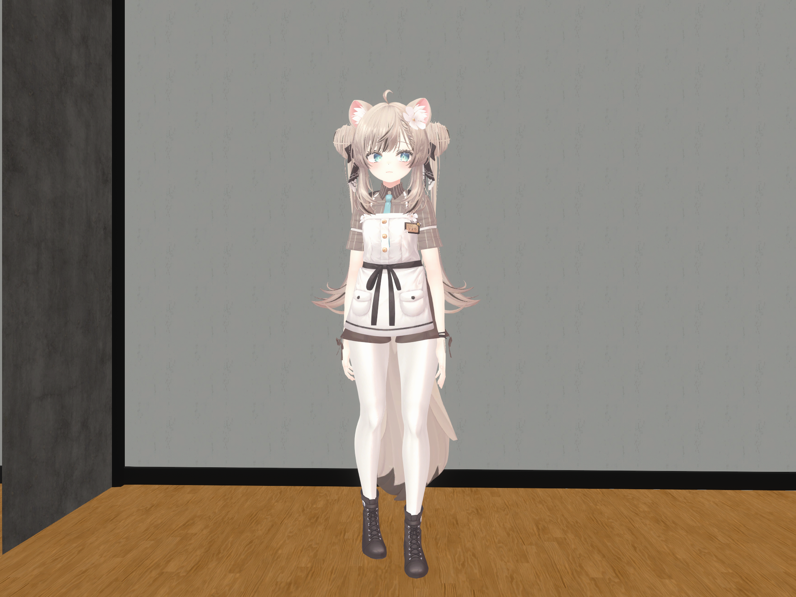

「Resoniteにアップロードしたけどなんか可愛くない……」みたいなアバター・衣装、あると思います。

まず、Resoniteで使うことのできるトゥーン調のマテリアル（シェーダー）は、**XiexeToonMaterialだけ**なので、基本XiexeToonで頑張る必要があります。

しかしながら「**可愛くない原因はXiexeToonだからだ**」**というわけではありません**。liltoonと完全に互換性があるわけではないものの、XiexeToonMaterialは陰影の色やアウトライン、MatCap、リムなどグラフィック機能が結構あるので、ほとんどのアバターで見た目を8割くらい再現できます。

以降、VRChatで**liltoon**マテリアルを使っているアバターを想定して説明を進めます。

## 1. 影が可愛くない→ShadowRampを調整する
見た目が可愛くない理由の9割がこれです　なおせます

<small>Resonite特有の質感をしたマヌカ</small>

<small>ShadowRampを変えたマヌカ×3</small>

ShadowRampのテクスチャを変えたマヌカです。左から
- XiexeToonデフォルト
- ShadowRampなし
- liltoonでGenerate Rampして出てきたテクスチャ

になります。

### liltoonのShadowRampを書き出して、割り当てる
liltoonには、影設定をテクスチャとして書き出す機能があります。

#### 手順
1. UnityエディターのProjectウィンドウで、目的のliltoonマテリアルを右クリックし、`liltoon > [Texture] Generate Ramp`をクリック。
   - テクスチャが生成されます。
2. 画像をResoniteにドラッグ&ドロップ（またはコピー&ペースト）
3. 目的のXiexeToonMaterialのShadowRampに割り当て

マテリアルを複数選択してGenerate Rampするとまとめて書き出せて時短になります

結構VRCぽい見た目になると思います。

### 時間が無い人向け
ShadowRampをとりあえず消すだけでも結構効果がある……かも。

XiexeToonMaterialのデフォルトShadowRampが**グレーのグラデーションになっておりVRC向けアバターの見た目とかなり相性が悪い**ので、ほとんどの場合消すだけで改善します。

ただし、陰影がつかなくなるので、アバターや衣装によっては違和感が残るかもしれません。

### うっすらOcclusionMapをいれる
XiexeToonは環境光をリムっぽく描画するのですが、これの影響で暗い部分がくすんで見えることがあります。

AmbientOcclusionMapに本当にうすい（真っ白でないがほとんど白の）グレー色のテクスチャ（SolidColorTextureとか）を入れると暗い部分のくすみがそれなりに解消します。

## 2. デスクトップモードで手がフワフワする

アバタールートについている`LocomotionAnimationHandMetrics`の値を調節しましょう。これは移動時にアバターの腕をフワフワ動かすためのコンポーネントです。

大体の場合
- `HandOffset（腕の広げ具合）`を少し小さく（0.1くらい）
- `ArmLength（腕を伸ばし具合）`を少し大きく
  
するとそれっぽくなる……気がします。
